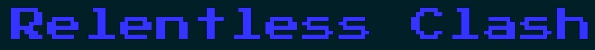
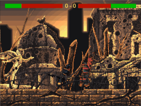
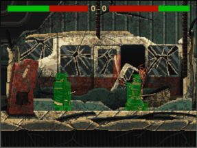
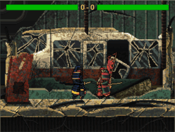

__Background__
----



Relentless Clash is a fighting game written in vanilla JavaScript in which 2 players engage in rapid sword combat until one player wins by two rounds. Players can control their characters using a keyboard or a controller. The major functionality of the game was written in a week, with minor art assets added afterwards.

__Technologies, Libraries, and APIs__
----
- Canvas API
- Keyboard API
- GamePad API
- HTML
- CSS

__Key Features__
----

In Relentless Clash, users can:
- Move their character using a keyboard or a controller and see dynamic feedback on their keypresses on the screen
- See a visual display of their current health via a health bar as well as their current score
- Swing their swords to deal damage to their opponent or parry their opponent's attacks
- Play against a computer player with 10 different difficulty levels

__Code Snippets__
----

There are many methods that come together to allow the users to play and interact with the in-game world. Here are some of the highlights for the major functions of the game.

__Collision Detection__



For every frame of animation, each character has multiple hurt boxes (shown in the gif in green) and, optionally, multiple hit boxes (shown in the gif in red) if they are attacking. Collision between characters is calculated by checking if two characters' hit and hurt boxes overlap in any way. The function Game#overlappingBoxes is generalized to work with any type of box to determine if the two boxes are overlapping.

```
overlappingBoxes(box1, box2) {
  let x1m, y1m, x1M, y1M;
  let x2m, y2m, x2M, y2M;
  [x1m, y1m, x1M, y1M] = [box1[0], box1[1],
                          box1[0] + box1[2], box1[1] + box1[3]];
  [x2m, y2m, x2M, y2M] = [box2[0], box2[1],
                          box2[0] + box2[2], box2[1] + box2[3]];

  if (x2m >= x1M || x1m >= x2M) {
    return false;
  } else if (y2m >= y1M || y1m >= y2M) {
    return false;
  } else {
    return true;
  }
}
```

Using this basic collision detection, the game can cause damage and knockback when a hit box overlaps an opponent's hurt box, push characters when a character's hurt box collides with an opponent's hurt box, and cause knockback when two hit boxes collide.

__Damage Calculation__



The amount of damage dealt to a character when they are hit with an attack is dependent on:

- the strength of the attack
- the hurt box(es) where the attack hits
- the number of frames in which the character collides with the hurt box

This code snippet demonstrates iteration through characters stored in an objects array to calculate hits, then deal damage and cause knockback which scales with the damage taken by the character.

```
handleHit(){
  // determine who is hitting which box
  let hits = [];
  for (let i = 0; i < this.objects.length; i++) {
    let hitbox = this.objects[i].getHitBoxes(GameView.MAIN_SCALE);
    if (hitbox) {
      hitbox = hitbox[0];
      for (let j = 0; j < this.objects.length; j++) {
        if (j !== i) {
          let hit = false;
          let hurtboxes = this.objects[j].getHurtBoxes(GameView.MAIN_SCALE);
          for (let k = 0; k < hurtboxes.length; k++) {
            if (this.overlappingBoxes(hitbox, hurtboxes[k])){
              hits.push([this.objects[i], this.objects[j], k]);
              hit = true;
              break;
            }
          }
          if (hit) {
            break;
          }
        }
      }
    }
  }

  // actually deal with the hits
  if (hits.length > 0) {
    let roundEnd = false;
    hits.forEach((hit) => {
      let origin = hit[0];
      let target = hit[1];
      let boxNum = hit[2];

      let damage = 0;
      switch (origin.currentAction){
        case ("attack1"):
          damage = 1;
          break;
        case ("attack2"):
          damage = 2;
          break;
        case ("attack3"):
          damage = 3;
          break;
      }

      // deal damage
      target.health -= damage*(3-boxNum)*0.25;
      if (target.health < 0){
        roundEnd = true;
        target.health = 0;
      }

      // cause knockback
      if (origin.pos[0] < target.pos[0]){
        target.pos[0] += Game.KNOCKBACK*(damage);
      } else{
        target.pos[0] -= Game.KNOCKBACK*(damage);
      }
    })

    if (roundEnd) {
      this.isRoundOver();
    }
  }
}
```

__Future Plans:__
----
I plan to add more gameplay stages and characters. Once these art assets are implemented, players will be able to choose their fighter from a menu before initiating combat. Additionally, some background music and sword sound effects will be added to enhance the ambiance of the gameplay.

__Art Credits:__
----
[Asian Night - Pixel Art Wallpaper](https://www.flickr.com/photos/rodrixap/10591266994/in/photostream/) by RodrixAP

[Samurai Characters Pixel Art](https://craftpix.net/freebies/free-samurai-pixel-art-sprite-sheets/) on craftpix.net

[War Pixel Art Background](https://craftpix.net/freebies/free-war-pixel-art-2d-backgrounds/) on craftpix.net

[Post Apocalyptic Pixel Art Background](https://craftpix.net/freebies/free-post-apocalyptic-pixel-art-game-backgrounds/) on craftpix.net
