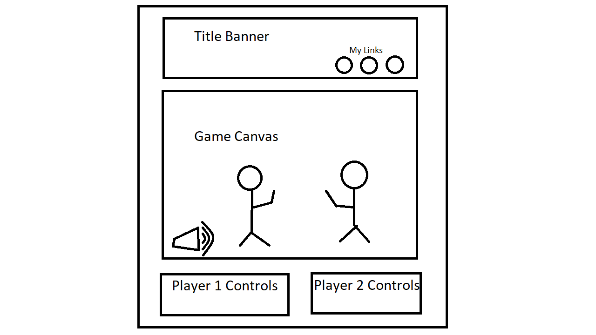

Background (Project Name to be determined)
-
----
{Definitely not Street Fighter} is a fighting game in which the user will fight in 3 rounds of combat against a computer AI using their keyboard to move a character around the screen. The player whose health bar hits zero first loses the round, and the player who wins 2 out of 3 rounds will be declared the victor.

Functionality & MVPs
-
----
In {Definitely Not Street Fighter}, users will be able to:
- Move their character using keyboard presses
- See a visual display of their current health via a health bar
- Punch and kick their opponent to deal damage to them
- Play against a computer player

In addition, this project will include:
- An __About__ modal to describe the rules of the game
- A production README

Wireframe
-
----

Technologies, Libraries, and APIs
-
----
The project will be implemented with the following technology:
- __Canvas API__ to render the actual game
- __Keyboard API__ to register keypresses

Implementation Timeline
-
----
- __Friday__: Minimal implementation of classes in order to get basic working functionality. By end of day, a single character will be visible on the canvas and will respond to keyboard presses. Commands to
- __Saturday__: Moving characters will be animated via sprites and the camera will move around to follow them.
- __Sunday__: Implementation of collision detection which will involve setting up hit boxes and hurt boxes. This will be a two day project.
- __Monday__: Collision detection and damage calculations part 2, electric boogaloo.
- __Tuesday__: Implementation of the computer player AI. It will approach the human player and throw some punches and kicks when it is within a certain distance to the player.
- __Wednesday__: Aesthetics for the general website to match the theme of the artwork chosen for the sprites. Focus will be entirely on styling while maintaining core functionality.
- __Thursday__: Deploy game on Github, work on production README, and wrap up any remaining features

Bonus Features
-
----
- __Gamepad API__ for using Switch/Xbox controllers to play the game
- A Menu for selecting your fighter
- Custom fighter artwork
- Special Attacks & Projectile Attacks
